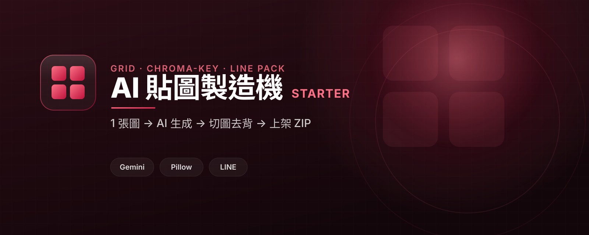

# AI Sticker Starter

把一張 AI 生成的綠幕九宮格,做成可以直接上架的 LINE 貼圖組。

## 繁中定位

**AI 貼圖製造機** 是「繪圖魔法師」系列的第一個進階模組,面向台灣繁中受眾。

- 主要受眾:已經會用 AI 生圖,想把生圖變成真正能用、能上架的成品。
- 核心承諾:看懂「生圖之後」的後處理管線 — 切格、綠幕去背、縮放到 LINE 規格、打包成 ZIP。
- CTA 頁:https://yazelin.github.io/ai-sticker-starter/

## 前置模組:生圖入門

這個模組假設你已經會「呼叫 Gemini 生圖」。如果還沒,先做前置模組:

- **生圖入門 gemini-image-starter**:https://github.com/yazelin/gemini-image-starter

本模組的 `app/gen.py` 用的就是同一種 Gemini 影像呼叫,差別只在這裡一次要求產出一張綠幕九宮格,方便後處理切格。引擎是 Google Gemini(`gemini-2.5-flash-image`),後處理用 Pillow + numpy。

## Part 1 vs Part 2

整個流程是:

```
grid PNG  ->  切成 9 格  ->  去背  ->  縮放/padding  ->  打包成 LINE 規格 ZIP
```

- **Part 1 · 天真版 baseline**(`part1_naive/naive.py`)
  生一張九宮格 → 切 9 格 → 用「顏色門檻」(`remove_bg_naive`)去綠底 → 存成單張。
  會動,但問題很明顯:邊緣留一圈綠色 halo、單張不是 LINE 規格、也沒打包成上架 ZIP。
  細節見 [`part1_naive/README.md`](part1_naive/README.md)。

- **Part 2 · 正規管線**(`app/sticker.py` + `demo_sticker.py`)
  `chroma_key` 做綠幕去背(despill 去綠邊 + 邊緣 erosion)→ `fit_pad` 縮放並置中到規格 → `build_line_pack` 打包成可直接上架的 ZIP。

LINE 規格:貼圖 370×320、main 240×240、tab 96×74,一組最少 8 張。

## Quick start

本教學以 [uv](https://docs.astral.sh/uv/) 為主。`uv sync` 會依 `pyproject.toml` + `uv.lock` 自動建立 `.venv` 並把相依套件裝好(毋須手動 venv / activate),`uv run` 直接在那個環境裡執行。**以下 `uv sync` / `uv run` 在 Ubuntu 與 Windows 完全相同。**

先安裝 uv(一次就好):

- Ubuntu / macOS:`curl -LsSf https://astral.sh/uv/install.sh | sh`
- Windows(PowerShell):`powershell -ExecutionPolicy ByPass -c "irm https://astral.sh/uv/install.ps1 | iex"`

裝完重開終端機,`uv --version` 印得出版本就 OK。

```
git clone https://github.com/yazelin/ai-sticker-starter.git
cd ai-sticker-starter
uv sync
uv run python client_smoke_test.py
```

`client_smoke_test.py` 會跑全部確定性測試(不需要 API key、不連網),預期輸出:

```
== tests/test_grid.py ==
OK: grid split test passed

== tests/test_chroma.py ==
OK: chroma key test passed

== tests/test_pack.py ==
OK: LINE pack test passed

== tests/test_gen_fake.py ==
OK: gen grid against fake Gemini server passed

OK: all checks passed
```

### 真的要生圖(需要 GEMINI_API_KEY)

去背、切格、打包都是純像素/檔案運算,所以測試完全不用 key。只有「真的請 Gemini 畫圖」這一步需要金鑰(免費申請:https://aistudio.google.com/apikey):

```
# Part 1 天真版:切格 + 門檻去背,存成 naive_01.png .. naive_09.png(有綠邊)
GEMINI_API_KEY=xxx uv run python part1_naive/naive.py

# Part 2 完整管線:存成 sticker_pack.zip,可直接拖進 LINE Creators Market
GEMINI_API_KEY=xxx uv run python demo_sticker.py
```

Windows(PowerShell)設定金鑰:`$env:GEMINI_API_KEY="xxx"`,指令其餘相同。

## 管線說明(`app/sticker.py`)

- `split_grid(image_bytes, rows=3, cols=3)` — 把一張 grid 切成 `rows*cols` 格 RGBA tiles,由左到右、由上到下。
- `remove_bg_naive(im, key=(0,255,0), tol=80)` — Part 1 baseline:離 key 顏色夠近就設透明。寫起來快,但邊緣留綠邊。
- `chroma_key(im, erode=1)` — Part 2:綠幕判定去背 + 邊緣 erosion 收一圈 + despill(把殘留的綠往 `max(r,b)` 壓),得到乾淨剪影。
- `fit_pad(im, size)` — 等比例縮放後置中貼到透明畫布,輸出剛好是目標尺寸。
- `build_line_pack(tiles)` — 取前 8 張剪影,輸出 LINE 規格 ZIP:`01.png`..`08.png`(370×320)+ `main.png`(240×240)+ `tab.png`(96×74)。

## 測試

`client_smoke_test.py` 串起 `tests/` 底下四個檔(全部不需 key、不連網):

- `tests/test_grid.py` — 切 9 格,每格尺寸正確。
- `tests/test_chroma.py` — 綠角落 α=0、主體中心 α=255;`chroma_key` 與 `remove_bg_naive` 都驗。
- `tests/test_pack.py` — ZIP 檔名為 `01`..`08` + `main` + `tab`,且尺寸分別是 370×320 / 240×240 / 96×74。
- `tests/test_gen_fake.py` — 對本地假 Gemini server(`tests/fake_gemini.py`)取一張 grid 再切格,驗證整條取圖路徑。

測試的素材是 `tests/fixtures.py` 產的綠底九宮格(每格一個彩色方塊),所以結果是確定性的。

## 真實案例 · 延伸資源

- **LINE Sticker Studio** — 這條管線的 production 版(Worker proxy + 配額 + Turnstile):https://github.com/yazelin/line-sticker-studio
- **PromptFill** — 結構化 prompt 工具:https://github.com/yazelin/PromptFill
- **LINE Creators Market** — 貼圖上架平台:https://creator.line.me/

## License

MIT

## Brand / CTA design

- Landing page: https://yazelin.github.io/ai-sticker-starter/
- CI spec: [DESIGN.md](DESIGN.md)
- Banner: [assets/banner.svg](assets/banner.svg)

---

## 關於作者

這個範本由 **林亞澤(Yaze Lin)** 維護 — 出身機電自動化系統整合,現在把同一套工程方法用在 AI 產品上。

- 任職於 **擎添工業 ChingTech**(1984 年成立的機電自動化公司:PLC 程式、機械手臂、AGV 無人搬運、半導體封測／PCB／面板／光學產線整合)。
- 技術筆記與更多範例:[yazelin.github.io](https://yazelin.github.io) · GitHub [@yazelin](https://github.com/yazelin)

## 從範本到正式產品

> 這個範本教的後處理管線,我們做成了上線中的真實產品。

- **LINE Sticker Studio** — 把同一條管線做成 production 版:Worker proxy、配額控管、Turnstile 防濫用,讓一般人也能在網頁上做貼圖。[github.com/yazelin/line-sticker-studio](https://github.com/yazelin/line-sticker-studio)
- **CTOS** — 企業 AI 工作平台:macOS 風格 Web 桌面、知識庫 RAG 檢索、產業專屬 Agent、LINE Bot 整合,資料留在台灣。[ching-tech.com](https://ching-tech.com) · [品牌站](https://ching-tech.github.io)
- **CTOS-Lite / CT JINN** — 把公司裝進 LINE 的個人版 AI 助理,加 LINE 即可試用:[@285fjkky](https://line.me/R/ti/p/@285fjkky)

> 想把這個範本落地成你公司或個人品牌的貼圖／生圖流程,或想上一堂從 0 到上架的課?
> 來信 yazelin@ching-tech.com,或追蹤上面的連結。
